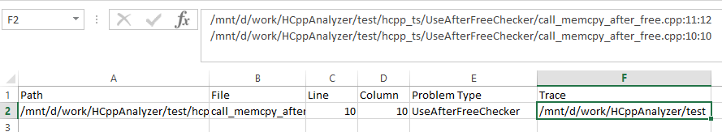
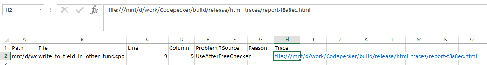
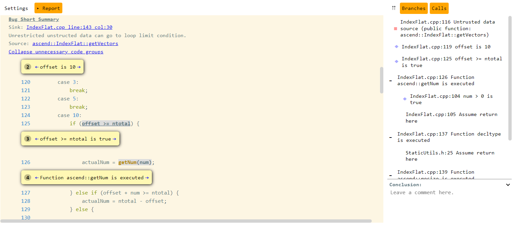

## Why to use Cooddy
Cooddy tool is source code analysis tool based on analysis of Abstract Syntax Tree, Control Flow and Call Graphs of program involving such techniques as Data-Flow Analysis and Static Symbolic Execution.


The main goal of the project is to create and engine providing features of program analysis to make it extensible for the needs of developers and QA tea

## List of detected issues
There are a few groups of checkeres, each of them have specific options, approaches and result representation
* [CWE Checkers](docs/CWE_Checkers.md)
	
	+ [BufferMaxSizeChecker](docs/BufferMaxSizeChecker.md)
	+ [CliInjectionChecker](docs/CliInjectionChecker.md)
	+ [DivisionByZeroChecker](docs/DivisionByZeroChecker.md)
	+ [DoNotReturnAddrOfLocalVarChecker](docs/DoNotReturnAddrOfLocalVarChecker.md)
	+ [FmtSpecMismatchChecker](docs/FmtSpecMismatchChecker.md)
	+ [FormatStringUsageChecker](docs/FormatStringUsageChecker.md)
	+ [IncompatiblePointerTypeChecker](docs/IncompatiblePointerTypeChecker.md)
	+ [IntegerOverflowChecker](docs/IntegerOverflowChecker.md)
	+ [LoopLimitTaintChecker](docs/LoopLimitTaintChecker.md)
	+ [MemoryAllocationSizeChecker](docs/MemoryAllocationSizeChecker.md)
	+ [MemoryAndResourceLeakChecker](docs/MemoryAndResourceLeakChecker.md)
	+ [MismatchedMemManagementChecker](docs/MismatchedMemManagementChecker.md)
	+ [NullPtrDereferenceChecker](docs/NullPtrDereferenceChecker.md)
	+ [OutOfBoundsChecker](docs/OutOfBoundsChecker.md)
	+ [TypeSizeMismatchChecker](docs/TypeSizeMismatchChecker.md)
	+ [UninitializedMemoryUsageChecker](docs/UninitializedMemoryUsageChecker.md)
	+ [UseAfterFreeChecker](docs/UseAfterFreeChecker.md)
* [Unused Variable Checkers](docs/Unused_Variable_Checkers.md)
	
	+ [UnusedMemberExpressionChecker](docs/UnusedMemberExpressionChecker.md)
	+ [UnusedParamChecker](docs/UnusedParamChecker.md)
	+ [UnusedVariableChecker](docs/UnusedVariableChecker.md)

## Command line options
  


| Option | Description |
| --- | --- |
| --scope | Specify path to file, folder or compile_commands.json to scan |
| --checkers | Specify checkers to be used. All by default. |
| --profile | Either a profile name (such as "default", "all", "cwe", etc.) OR and absolute path to a profile file. |
| --compile-options | Specify compile options |
| --gen-annotations | Control for which functions annotations should be generated. Pattern: <none [u][s][t] all>(default: none)<li>none - generation of annotation is turned off;</li><li>all - all functions;</li><li>u - functions that do not have a definition in the TU;</li><li>t - functions that are the source of untrusted data;</li><li>s - functions from system libraries;</li>
 |
| --log | Specify log details. Possible values: off, fatal, error, warn, warning, info, debug, trace, all. By default: info. |
| --compiler | Path to compiler binary which should be used to compile project. By default: /usr/bin/gcc |
| --reporter | Specify format for report. Possible values: out, csv, json, csv-html. By default: out. |
| --results-path | Path where report will be stored. By default: coddy binary path. |
| --gen-callgraph | Name of entry point function, for which should be collected paths in call graph. |
| --min-problem-severity | Specify the minimal severity of problem to report. Possible values: <error|warning|notify> |
| --callgraph-depth | Sets the depth of the call graph path. |
| --assumptions-in-trace |  |
| --persistent-storage |  |
| --taint-options | Control which functions can be considered "untrusted". Pattern: <none [u][s][p] all> (default: none):<li>none - taint analysis is turned off;</li><li>u - functions that do not have a definition in the TU;</li><li>s - functions marked with a macro specified in --taint-macro;</li><li>p - public API functions (with a definition, unused from this TU, ext. linkage);</li><li>all - all functions.</li> |
| --taint-macro | set macro used as an annotation to tainted functions (default: EXTER_ATTACK) |
| --ignore-suppresses | Show suppressed warnings |
| -v, --version | Print version. |
| -h, --help | Print usage. |
| --rhs-servers | Specify rhs server addresses list. This option overrides rhs servers list defined in profile. |

## Build
Check following documentation for more info on [how-to build Cooddy.](docs/Build.md)

## Running tests
For launching tests, use following command:


```bash
cd <cooddy_root_dir>/build/<your_build_type>
./cooddyTest
```


  

### Usage


You can pass as input folder. Expected to found compile_commands.json in this folder


```bash
./cooddy --scope=/your/folder
```


  

#### 
 Json compilation database input


You can pass as input compilation database file.


```bash
./cooddy --scope=/your/path/to/compile_db.json
```


  

### List of reporters
The presentation of result is depend on which reporter was used, during the analyses. The examples of the result of each reporter you can see below 

<details>

<summary>Result in JSON
</summary>
Result will be presented in cooddy_result.json, which is located in the current working directory by default or in location passed to argument results-path. This file contains list of problems, found in scope.

By calling following example of analyses


```bash
/mnt/d/work/Cooddy/build/release/cooddy --scope=/mnt/d/work/kvdb_test --results-path=/mnt/d --reporter=json
```

the content of result will be following


```
{
   "start_time":"2021-10-06T08:30:08.339Z",
   "end_time":"2021-10-06T08:30:08.557Z",
   "profile":"default.profile",
   "command_line":"--scope=/mnt/d/work/kvdb_test --results-path=/mnt/d --reporter=json",
   "git_commit":"50cff76197957237806a704ff1c711e220f58099",
   "git_version":"v1_7",
   "problems":[
      {
         "file":"/mnt/d/work/Cooddy/test/test_cases/analyzerToolTest/test_trace.cpp",
         "line":5,
         "offset":9,
         "length":7,
         "problem_class":{
            "name":"SSR_1.1.2.1",
            "severity":"ERROR",
            "profile":"Common Weakness Enumeration",
            "inspection_name":"NullPtrDereferenceChecker"
         },
         "highlighted_element":"",
         "description":"Null dereference",
         "trace":[
            {
               "file":"/mnt/d/work/Cooddy/test/test_cases/analyzerToolTest/test_trace.cpp",
               "line":12,
               "col":22,
               "end_line":12,
               "end_col":28
            },
            {
               "file":"/mnt/d/work/Cooddy/test/test_cases/analyzerToolTest/test_trace.cpp",
               "line":13,
               "col":15,
               "end_line":13,
               "end_col":22
            },
            {
               "file":"/mnt/d/work/Cooddy/test/test_cases/analyzerToolTest/test_trace.cpp",
               "line":5,
               "col":9,
               "end_line":5,
               "end_col":16
            }
         ]
      }
   ]
}
```


</details>


<details>

<summary>Result in human readable format
</summary>
By default result will be printed in output of the console. If saving result in human-readable format in file is required, you need to pass path to location of result file to argument results-path. This file contains list of problems, found in scope.

By calling following example of analyses


```bash
/mnt/d/work/Cooddy/build/release/cooddy --scope=/mnt/d/work/kvdb_test --results-path=/mnt/d
```

the content of result will be following


```
Problem found. NullPtrDereferenceCheker: Null dereference File: /mnt/d/work/test_projects/sqlite_vm/mnt/storage/projects-for-analysis/sqlite/bld/sqlite3.c:59362:6, Trace: File: /mnt/d/work/test_projects/sqlite_vm/mnt/storage/projects-for-analysis/sqlite/bld/sqlite3.c:55128:44 File: /mnt/d/work/test_projects/sqlite_vm/mnt/storage/projects-for-analysis/sqlite/bld/sqlite3.c:55128:44 Problem found. UninitializedMemoryUsageChecker: Do not access uninitialized memory. File: /mnt/d/work/test_projects/sqlite_vm/mnt/storage/projects-for-analysis/sqlite/bld/sqlite3.c:79959:13, Trace: File: /mnt/d/work/test_projects/sqlite_vm/mnt/storage/projects-for-analysis/sqlite/bld/sqlite3.c:79869:3 Problem found. NullPtrDereferenceCheker: Null dereference File: /mnt/d/work/test_projects/sqlite_vm/mnt/storage/projects-for-analysis/sqlite/bld/sqlite3.c:79768:5, Trace: File: /mnt/d/work/test_projects/sqlite_vm/mnt/storage/projects-for-analysis/sqlite/bld/sqlite3.c:80353:18 File: /mnt/d/work/test_projects/sqlite_vm/mnt/storage/projects-for-analysis/sqlite/bld/sqlite3.c:80324:28 Problem found. NullPtrDereferenceCheker: Null dereference File: /mnt/d/work/test_projects/sqlite_vm/mnt/storage/projects-for-analysis/sqlite/bld/sqlite3.c:80356:12, Trace: File: /mnt/d/work/test_projects/sqlite_vm/mnt/storage/projects-for-analysis/sqlite/bld/sqlite3.c:80326:29 Problem found: Strictly check integer operations to ensure no overflow, wrap or division by zero. File: /mnt/d/work/test_projects/sqlite_vm/mnt/storage/projects-for-analysis/sqlite/bld/sqlite3.c:28704:35, Trace: File: /mnt/d/work/test_projects/sqlite_vm/mnt/storage/projects-for-analysis/sqlite/bld/sqlite3.c:28701:11
```


</details>


<details>

<summary>Result in CSV format
</summary>
Result will be presented in cooddy_result.csv, which is located in the current working directory by default or in location passed to argument results-path. This file contains list of problems, found in scope.

By calling following example of analyses


```bash
/mnt/d/work/Cooddy/build/release/cooddy --scope=/mnt/d/work/kvdb_test --results-path=/mnt/d --reporter=csv
```

In Excel the content of result will be following:




</details>


<details>

<summary>Result in CSV format with HTML report
</summary>
Result will be presented in cooddy_result.csv, which is located in the current working directory by default or in location passed to argument results-path. This file contains list of problems, found in scope.

By calling following example of analyses


```bash
/mnt/d/work/Cooddy/build/release/cooddy --scope=/mnt/d/work/test --reporter=csv-html
```

### In Excel the content of result will be following:


When clicking to file with trace with name report-f8a8ec.html you can see description of error trace.

Here you can review source code step by step to determine the source of the some specific error, with description on each step.




</details>


<details>

<summary>Result in HTML report
</summary>
Result will be presented in cooddy_result.html, which is located in the current working directory by default or in location passed to argument results-path. This file contains list of problems, found in scope.

By calling following example of analyses


```bash
/mnt/d/work/Cooddy/build/release/cooddy --scope=/mnt/d/work/test --reporter=html
```

In HTML the content of result will be following:


</details>

### Profiles description
Check following documentation for more info on [Profiles](docs/Profiles.md)

### Annotation description
Check following documentation for more info on [Annotations](docs/Annotations.md)

### Extensibility
TBD

### How to develop custom checker
[Developing custom checker](docs/How_to_develop_a_custom_checker.md)

### How to implement your own reporter
TBD

## Troubleshooting
Check following documentation for more info on [Troubleshooting](docs/Troubleshooting.md)

## License
Distributed under the GPL-3.0 license with linking exception. See `LICENSE.txt` for more information.

## Contribution
If you have a suggestion that would make this tool better, please fork the repo and create a pull request. You can also simply open an issue with the tag "enhancement" or "bug". Don't forget to give the project a star! Thanks again!


1. Fork the Project
2. Create your Feature Branch (git checkout -b feature/AmazingFeature)
3. Commit your Changes (git commit -m 'Add some AmazingFeature')
4. Push to the Branch (git push origin feature/AmazingFeature)
5. Open a Pull Request