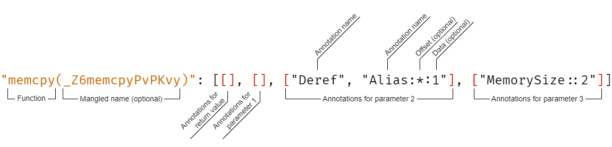
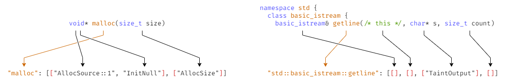
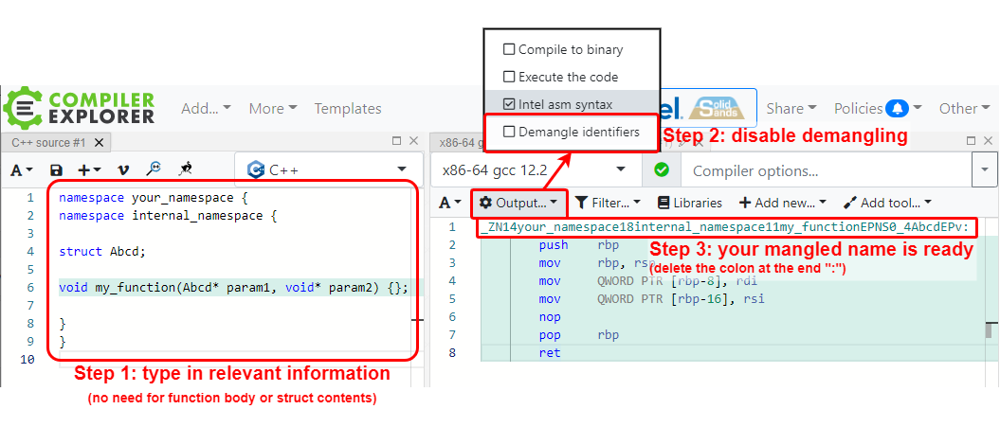

Annotation is a statement about a variable or parameter which should be considered during analysis by Cooddy. Examples of these statements are: "this variable contains untrusted input", "a pointer that is passed into this parameter will be dereferenced", and many more.

Consider an example:

**Example**

```cpp
int* SometimesReturnsNull();
int main() {
    int* ptr;
    ptr = SometimesReturnsNull();
    return *ptr;
}
```

In the code above the return value of the function "SometimesReturnsNull" is dereferenced. But since there is no function definition, Cooddy cannot know that it could return NULL and no error will be reported for this code. To help with situations where Cooddy must know some additional information about functions, you can use annotations.

# Writing annotations



All annotations that Cooddy knows about are located in three JSON files:

| Type of annotated functions                                                        | File location                                                     |
|------------------------------------------------------------------------------------|-------------------------------------------------------------------|
| Built-in and standard library functions, such as `malloc`, `new`, `std::max`, etc. | `<*Cooddy installation folder*>/.cooddy/.annotations.json`        |
| User-defined annotations for your project                                          | `<*compile_commands.json base folder*>/.cooddy/.annotations.json` |

When adding custom annotations for your project, use the last specified path.

Each file contains a JSON object, which is mapping function names to annotations for each of the parameters:

**Annotations file example**

```json
{
  "malloc": [["AllocSource::1", "InitNull"], ["AllocSize"]],
  "operator new(Znwm)": [["AllocSource::2"], []],
  "std::basic_istream::getline": [[], [], ["TaintOutput"], []]
}
```

Each line corresponds to a single function. The function identifier (more information below) is paired with an array of arrays—a list of annotations for each of the parameters and the return value. First list of annotations is for the return value; if the function is a non-static class method, then the second list is for the hidden `this` pointer; everything after is for parameters. When annotating a function with a variadic parameter `...`, such as in `printf`, specify one annotation list which will be applied to all the variadic arguments.



# Writing the function name

To match a line in the "annotations.json" file to a particular function in the code, Cooddy needs a unique identifier of the function. In most cases, it is sufficient to type in the *fully-qualified name* (FQN). A function's FQN contains all namespaces and classes the function is located in, separated by `::`. For example, for the function `getline` from the `basic_istream` class of the standard library, it's FQN is `std::basic_istream::getline`. For a free function in the global namespace a FQN is the same as the function name (e.g. `malloc`).


> ⚠️ Template functions and classes

Template parameters for functions are not present in the FQN. If the function is a method of a template class, the template parameters of the class can also be omitted, in which case the annotation applies to every instantiation of the class. If you *need* to annotate a function only in a specific template instantiation, you can specify concrete fully-qualified types in the angle brackets right after the class name (e.g. `std::shared_ptr<my::Widget>::get`). We suggest doing this only for very simple templates, as there are certain bugs which may prevent matching for no obvious reason. See below for a more robust method of annotating concrete functions.

## Mangled names

In case of overloaded functions, i.e. several functions with the same FQN, which differ only by their arguments, you must specify the *mangled name* of the function in parenthesis just after the FQN. Mangled name is a term from compiler theory. It is an encoding of a function's name, parameters, return type, templates, and other qualities that allow the compiler (and Cooddy) to uniquely identify a particular function's signature, even if the function is overloaded many times.

Mangled name can be used to uniquely identify any concrete function, including specific template instantiations.


<details>

<summary>Examples of mangled names
</summary>


| Function signature                                                     | Mangled name                                                        |
|------------------------------------------------------------------------|---------------------------------------------------------------------|
| float round (float arg);                                               | _Z5roundf                                                           |
| double round (double arg);                                             | _Z5roundd                                                           |
| long double round (long double arg);                                   | _Z5rounde                                                           |
| double std::stod(const std::string& str, std::size_t* pos = nullptr);  | _ZNSt7__cxx114stodERKNS_12basic_stringIcSt11char_traitsIcESaIcEEEPy |
| double std::stod(const std::wstring& str, std::size_t* pos = nullptr); | _ZNSt7__cxx114stodERKNS_12basic_stringIwSt11char_traitsIwESaIwEEEPy |

</details>


To find the mangled name of your function, Cooddy provides a special `--mangle` switch. When using Cooddy with this switch, no analysis will be performed, but the engine will print a table of mangled names to the terminal:

```
$ cooddy --scope <your scope> --mangle sqrt
  ...
[INFO] Mangled names for "sqrt":
SIGNATURE                        MANGLED NAME
double sqrt(double)              sqrt
double sqrt(type-parameter-0-0)  <template function>
double sqrt<int>(int)            _Z4sqrtIiEdT_
float sqrt(float)                _Z4sqrtf
long double sqrt(long double)    _Z4sqrte
```

In mangle mode Cooddy will find all functions either called or defined somewhere, with the name provided to --mangle. The "Signature" column contains the found function with the return type and argument types, and the "Mangled name" column contains the mangled name you should use to refer to that particular function:

```
"sqrt(Z4sqrte)": [...],  // Will only apply to the version of sqrt taking a long double argument.
```

Also, note that there is a template function mentioned as `double sqrt(type-parameter-0-0)` which does not have a mangled name because it is not instantiated with concrete types. If instantiated (explicitly in code, or implicitly by calling it with a particular argument type), another entry will be added just below, such as `double sqrt<int>(int)`.

When looking for a common function name such as `begin`, `init`, or something which appears in many classes and namespaces, you can specify a qualified name. For example, using `--mangle my_class::begin` will only show `begin` functions contained inside a `my_class` scope. Additionally, prefixing the name with `::`, such as `--mangle ::fopen`, will only find functions in the global scope.


<details>

<summary>Legacy method of mangling names
</summary>

> ⚠️ This legacy method is deprecated and is no longer recommended or supported.

To find out your function's mangled name, we suggest you use an online tool called [Compiler Explorer](https://godbolt.org/). This tool shows you the assembly generated by your code, which contains a mangled name. In the code editor to the left, type in your function signature. No body is required, but any namespace names and nested classes are. Then, on a tool panel on the right, toggle "Output..." → "Demangle identifiers" to OFF. Your mangled name should be displayed on the right. If the compiler says that no code was produced, add a dummy function that calls whatever function you need, so compiler generates the necessary code.




</details>


If you'd like to generate mangled names automatically for functions in your project with no definition, a simpler approach might be to use the ["gen-annotations" commandline flag](Command_line_options.md).

# Annotation syntax

Each annotation description has the following structure:

```
"<Annotation name>:<Offset (optional)>:<Data (optional)>"
```


*Annotation name* is one of the predefined names that explains what information this annotation is conveying to the analysis. See the [annotation reference](Annotations.md) below for a list of names.
*Offset* is useful for memory blocks, and specifies where in the block does the annotation apply. Possible values are `*`, `&`, `[<number>]` and any combination of those values. 

**Write to the value itself**

```
["Write"]
```

**Write by dereferencing a pointer, applies to the whole memory block**

```
["Write:*"]
```

**Zero initialize the whole nested memory block, pointed to by the second element of the outer memory block**

```
["InitNull:[2]*"]
```

**Zero-initialize the second item in the memory block**

```
["InitNull:[2]"]
```

*Data* is any information specific to the annotation. See the [annotation reference](Annotations.md) below for more information.
**Annotation BuffSize specifies that the size of the buffer passed in has the size from the 2nd argument**

```
["BuffSize::2"]
```

# Annotations reference

| Name             | Description                                                                                                                                                                                                                                                                 | Data field                                                                                                                                                                                                                 |
|------------------|-----------------------------------------------------------------------------------------------------------------------------------------------------------------------------------------------------------------------------------------------------------------------------|----------------------------------------------------------------------------------------------------------------------------------------------------------------------------------------------------------------------------|
| ArrayIndex       | Indicates the return value or argument value can be used as an index in the specified arrayFor exampleint SearchSomethingIn(char* data)"SearchSomethingIn":[["ArrayIndex::1"],[]]                                                                                           | Index of the function's argument with pointer or array                                                                                                                                                                     |
| Condition        | Indicates specified condition for return expression or argument.Can be used for reducing false positive reports from Cooddy. For example if undefined function always returns value, which more than 0, you can add annotation for function with annotation "Condition::>0" | Expression which describes a condition. See [expression syntax](Annotations.md) for the details.**Example:** "Condition::>0", "Condition::<$1 + 1"                                                                         |
| Result           | Indicates specified value for return expression or argument.                                                                                                                                                                                                                | Expression which describes a result value. See [expression syntax](Annotations.md)for the details.**Example:** "Result::42", "Result::$1!=0"                                                                               |
| Deref            | Indicates that there is dereferencing of the variable                                                                                                                                                                                                                       | —                                                                                                                                                                                                                          |
| Write            | Indicates that there is writing in the variable                                                                                                                                                                                                                             | —                                                                                                                                                                                                                          |
| BuffSize         | Indicates a buffer parameter, which size is limited by another function parameter                                                                                                                                                                                           | Index of the function's argument with destination max size parameter**Example:** "BuffSize::2"                                                                                                                             |
| MemorySize       | Indicates a buffer parameter, which size is limited by this parameter                                                                                                                                                                                                       | Index of the function's argument with buffer which size should be greater or equal of annotated parameter value**Example:** "MemorySize::1"                                                                                |
| ZeroMemory       | Indicates that memory under pointer is initialized with 0                                                                                                                                                                                                                   | —                                                                                                                                                                                                                          |
| FreeSource       | Indicates that the variable is freed. Source Annotation                                                                                                                                                                                                                     | —                                                                                                                                                                                                                          |
| UserInput        | Indicates that value is getting from input                                                                                                                                                                                                                                  | —                                                                                                                                                                                                                          |
| FormatString     | Indicates that value is a format string                                                                                                                                                                                                                                     | —                                                                                                                                                                                                                          |
| Read             | Indicates that there is reading of the variable                                                                                                                                                                                                                             | —                                                                                                                                                                                                                          |
| InitNull         | Indicates that value could be initialized with null                                                                                                                                                                                                                         | —                                                                                                                                                                                                                          |
| Divider          | Indicates that value is a divider in division expression                                                                                                                                                                                                                    | —                                                                                                                                                                                                                          |
| Alias            | Indicates that value is an alias to the source of annotation.Also it is used to indicate if field of one object is an alias of another object or if some item in array or container is an alias of another object.                                                          | Index of position of alias value is 0 for object itself and non-zero for its fields or array items. There are 2 indexes for this annotation - for offset in current state and in the aliased object.**Example:** "Alias:0" |
| AddrOfLocalVar   | Indicates that value stores an address to local variable                                                                                                                                                                                                                    | —                                                                                                                                                                                                                          |
| FreeSink         | Indicates that the variable is freed. Sink Annotation                                                                                                                                                                                                                       | Kind of free function1 - free2 - operator delete3 - operator delete[]4 - close file (fclose, close) 5 - mutex unlock (pthread_mutex_unlock)**Example:** "FreeSink::2"                                                      |
| AllocSource      | Indicates that the variable is allocated.                                                                                                                                                                                                                                   | Kind of alocation function1 - malloc, calloc, realloc2 - operator new3 - operator new[]4 - open file (fopen, open)5 - mutex lock (pthread_mutex_lock)**Example:** "AllocSource::3"                                         |
| TaintInput       | Indicates that value passed into the function is untrusted data                                                                                                                                                                                                             | Applies to defined functions.During analysis of the function body, values passed through "TaintInput" parameters are treated as untrusted.                                                                                 |
| TaintOutput      | Indicates that value returned from the function is untrusted data                                                                                                                                                                                                           | Applies to undefined functions.During analysis of the function call, values passed through "TaintOutput" out-parameters (such as pointers) or the return value are treated as untrusted in the caller afterwards.          |
| TaintPropagation | Indicates that value is tainted (untrusted) data propagated from another function parameter                                                                                                                                                                                 | The number of parameter *from* which tainted data should be propagated (started from 0).**Example:** "TaintPropagation::1"                                                                                                 |
| Access           | TODO                                                                                                                                                                                                                                                                        | TODO                                                                                                                                                                                                                       |

# Expression syntax

"Result" and "Condition" annotations data is an expression.

Expression can contain:

* arithmetic operators(`+`, `-`, `*`, `/`, `%`);
* relationship operators(`<`, `<=`, `>`, `>=`, `!=`, `==`);
* logical operators(`||` - logical OR, `&&` - logical AND);
* conditional(ternary) operators;
* integer constants;
* values related to arguments of function.

Examples:

```
// function which never returns 0
"myFoo1": [["Condition::!=0"]]
// function which always returns 42
"myFoo2": [["Result::42"]]
// function which returns value is greater then 10 and less then 20
"myFoo3": [["Condition::>10", "Condition::<20"]]
// function which returns value is greater then 1st argument and less then 2nd argument
"myFoo4": [["Condition::>$1", "Condition::<$2"]], [], []] 
// function which returns value is calculated as (<1st arg> + <2nd arg> * <3rd arg>) 
"myFoo5": [["Result::$1 + $2 * $3"]], [], [], []] 
// functions which returns minimum of two numbers 
"myFoo6": [["Result::ite($1 < $2, $1, $2)"], [], []]
```
