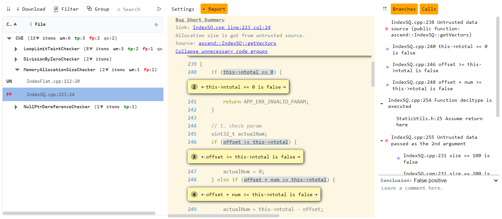

The presentation of result is depend on which reporter was used, during the analyses. The examples of the result of each reporter you can see below 


<details>

<summary>Result in JSON
</summary>
Result will be presented in cooddy_result.json, which is located in the current working directory by default or in location passed to argument results-path. This file contains list of problems, found in scope.

By calling following example of analyses


```bash
/mnt/d/work/Cooddy/build/release/cooddy --scope=/mnt/d/work/kvdb_test --results-path=/mnt/d --reporter=json
```

the content of result will be following


```json
{
   "start_time":"2021-10-06T08:30:08.339Z",
   "end_time":"2021-10-06T08:30:08.557Z",
   "profile":"default.profile",
   "command_line":"--scope=/mnt/d/work/kvdb_test --results-path=/mnt/d --reporter=json",
   "git_commit":"50cff76197957237806a704ff1c711e220f58099",
   "git_version":"v1_7",
   "problems":[
      {
         "file":"/mnt/d/work/Cooddy/test/test_cases/analyzerToolTest/test_trace.cpp",
         "line":5,
         "offset":9,
         "length":7,
         "problem_class":{
            "name":"SSR_1.1.2.1",
            "severity":"ERROR",
            "profile":"Common Weakness Enumeration",
            "inspection_name":"NullPtrDereferenceChecker"
         },
         "highlighted_element":"",
         "description":"Null dereference",
         "trace":[
            {
               "file":"/mnt/d/work/Cooddy/test/test_cases/analyzerToolTest/test_trace.cpp",
               "line":12,
               "col":22,
               "end_line":12,
               "end_col":28
            },
            {
               "file":"/mnt/d/work/Cooddy/test/test_cases/analyzerToolTest/test_trace.cpp",
               "line":13,
               "col":15,
               "end_line":13,
               "end_col":22
            },
            {
               "file":"/mnt/d/work/Cooddy/test/test_cases/analyzerToolTest/test_trace.cpp",
               "line":5,
               "col":9,
               "end_line":5,
               "end_col":16
            }
         ]
      }
   ]
}
```


</details>


<details>

<summary>Result in human readable format
</summary>
By default result will be printed in output of the console. If saving result in human-readable format in file is required, you need to pass path to location of result file to argument results-path. This file contains list of problems, found in scope.

By calling following example of analyses


```bash
/mnt/d/work/Cooddy/build/release/cooddy --scope=/mnt/d/work/kvdb_test --results-path=/mnt/d
```

the content of result will be following


```
Problem found. NullPtrDereferenceCheker: Null dereference File: /mnt/d/work/test_projects/sqlite_vm/mnt/storage/projects-for-analysis/sqlite/bld/sqlite3.c:59362:6, Trace: File: /mnt/d/work/test_projects/sqlite_vm/mnt/storage/projects-for-analysis/sqlite/bld/sqlite3.c:55128:44 File: /mnt/d/work/test_projects/sqlite_vm/mnt/storage/projects-for-analysis/sqlite/bld/sqlite3.c:55128:44 Problem found. UninitializedMemoryUsageChecker: Do not access uninitialized memory. File: /mnt/d/work/test_projects/sqlite_vm/mnt/storage/projects-for-analysis/sqlite/bld/sqlite3.c:79959:13, Trace: File: /mnt/d/work/test_projects/sqlite_vm/mnt/storage/projects-for-analysis/sqlite/bld/sqlite3.c:79869:3 Problem found. NullPtrDereferenceCheker: Null dereference File: /mnt/d/work/test_projects/sqlite_vm/mnt/storage/projects-for-analysis/sqlite/bld/sqlite3.c:79768:5, Trace: File: /mnt/d/work/test_projects/sqlite_vm/mnt/storage/projects-for-analysis/sqlite/bld/sqlite3.c:80353:18 File: /mnt/d/work/test_projects/sqlite_vm/mnt/storage/projects-for-analysis/sqlite/bld/sqlite3.c:80324:28 Problem found. NullPtrDereferenceCheker: Null dereference File: /mnt/d/work/test_projects/sqlite_vm/mnt/storage/projects-for-analysis/sqlite/bld/sqlite3.c:80356:12, Trace: File: /mnt/d/work/test_projects/sqlite_vm/mnt/storage/projects-for-analysis/sqlite/bld/sqlite3.c:80326:29 Problem found: Strictly check integer operations to ensure no overflow, wrap or division by zero. File: /mnt/d/work/test_projects/sqlite_vm/mnt/storage/projects-for-analysis/sqlite/bld/sqlite3.c:28704:35, Trace: File: /mnt/d/work/test_projects/sqlite_vm/mnt/storage/projects-for-analysis/sqlite/bld/sqlite3.c:28701:11
```


</details>


<details>

<summary>Result in CSV format
</summary>
Result will be presented in cooddy_result.csv, which is located in the current working directory by default or in location passed to argument results-path. This file contains list of problems, found in scope.

By calling following example of analyses


```bash
/mnt/d/work/Cooddy/build/release/cooddy --scope=/mnt/d/work/kvdb_test --results-path=/mnt/d --reporter=csv
```

In Excel the content of result will be following:


</details>


<details>

<summary>Result in CSV format with HTML report
</summary>
Result will be presented in cooddy_result.csv, which is located in the current working directory by default or in location passed to argument results-path. This file contains list of problems, found in scope.

By calling following example of analyses


```bash
/mnt/d/work/Cooddy/build/release/cooddy --scope=/mnt/d/work/test --reporter=csv-html
```

### In Excel the content of result will be following:


When clicking to file with trace with name report-f8a8ec.html you can see description of error trace.

Here you can review source code step by step to determine the source of the some specific error, with description on each step.


</details>


<details>

<summary>Result in HTML report
</summary>
Result will be presented in cooddy_result.html, which is located in the current working directory by default or in location passed to argument results-path. This file contains list of problems, found in scope.

By calling following example of analyses


```bash
/mnt/d/work/Cooddy/build/release/cooddy --scope=/mnt/d/work/test --reporter=html
```

In HTML the content of result will be following:




</details>
