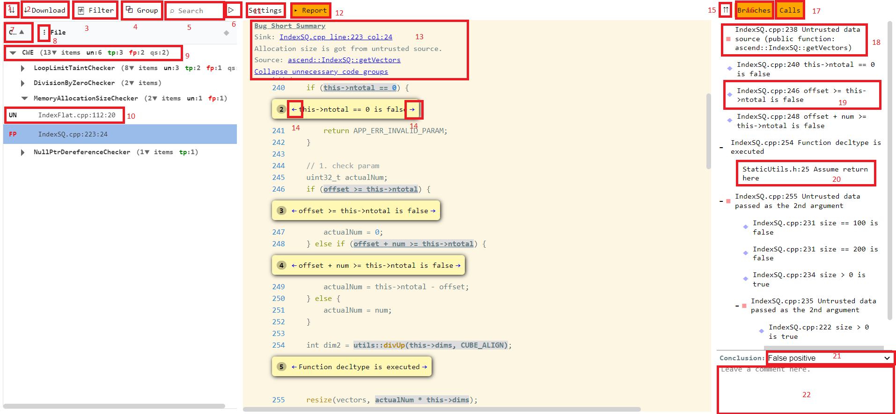
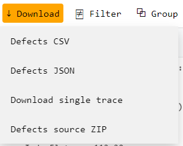
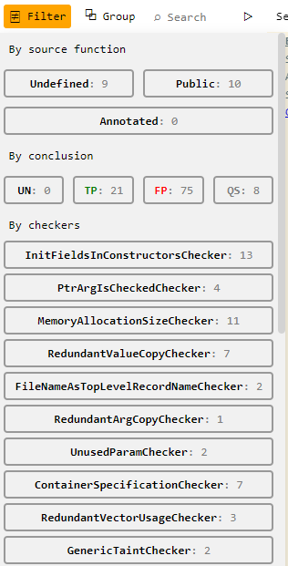
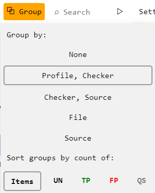
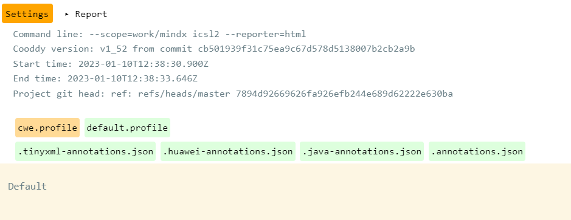
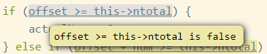

## Interface description

1. Expand/Collapse all groups of defects. By default, defects are grouped by Profile → Checker, and can be switched (see 4). Groups can be expanded or collapsed individually by clicking triangle button in section 9.
2. Download

You can download currently filtered defects in grid view to the csv or json format

The current selected trace can be downloaded to the separate html file for sharing with other participants

All code snippets integrated in report can be downloaded as a zip file

3. Filter

Defects in grid view can be filtered by source, conclusion or checker name.

4. Group

Defects can be grouped by diferent properties, and sorted by aggregative value.

5. Full text search. Defects in grid view will be filtered by inclusion of text in any field, except trace source code snippets.
6. Expand grid view on full screen. Additional columns will be shown due to available free space on screen.
7. Column with sorting order indicator. Click by sorting order indicator changes sort order by this column and discard all other sorting rules applied before. Ctrl+click will keep sorting order applied before for other columns? and additionaly sorts by current column with low priority (sort order by current column will be applied only if previously applied sort order returns equality of the defects order)
8. Column chooser.

Visibility of columns can be changed. You can hide and show the columns you need

9. Group row. Can be expanded or collapsed by clicking the triangle. There is group summary information about defects in the group an group sorting order indicator
10. Defect summary. Clicking the row you can see the traces for different defects. Currently selected defect is highlighted.
11. The cooddy analysis settings.

12. The selected defect trace view

There is a summary about cooddy settings and statistics of the analysis was done. Loaded profiles and annotation files. If customer modified or included custom profiles - there will be shown the sources of it.

13. Defect summary.

Clicking by "Bug Summary" header you can show or hide additional information about defect.

You can navigate to the sink or source points in the trace.

You can collapse the code snippets to the couple of lines of code around trace points.

14. Navigate to the previous or next trace point in the source code. The currently navigated trace point will be highlighted.
15. Expand or collapse all trace tree view groups. Also tree view group can be expanded or collapsed individually clicking the '+' or '-' buttons.
16. Show or hide branches from the trace tree view and code snippets. Hided branches will be shown in code tooltips:

17. Show or hide function calls in trace.
18. The major trace point describing the defect, or directly lying on the path to the sink or source point.
19. The branch
20. The function call or return point from the function.
21. Report history server defect status. You can edit and change it.
22. Custom comment to the defect. Can be up to 1024 characters. Stored in report history server, and can be independently updated