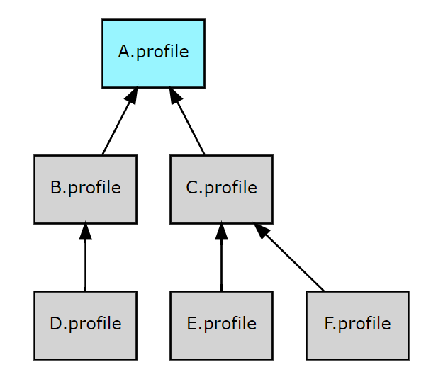

Checkers with some meaning of the results can be grouped to the profile.

There are several profiles distributed with Cooddy out of the box:

| File name   | Profile Name    | Meaning                                 |
|-------------|-----------------|-----------------------------------------|
| all         | All             | All supported checkers                  |
| cwe         | CWE             | MITRE CWE listed checkers               |
| default     | Default         | Default profile of Cooddy               |
| unused_vars | UnusedVariables | Checkers for unused variables in a code |

## Usage

To specify profile use the --profile option with the path to the file (default: "default")

Example

```bash
$ cooddy --scope=/scope/to/analyse/ --profile=cwe
```

## Profile structure

You can define your own profile with custom checkers. See the [How to develop a custom checker](How_to_develop_a_custom_checker.md)

## Profile hierarchy

You can define your own profile aggregating checkers from other profiles. To aggregate checkers from other profile define the "profiles" section.

For example the "all" profile aggregates the inspections from cwe.profile and unused_vars.profile

```json
all.profile.json content:
{
  ...
  "profiles": ["cwe", "unused_vars"],
  ...
}
A.profile.json content:
{
  ...
  "profiles": ["B", "C"],
  "checkers": {
    "FirstChecker": { "id": "First", "severity": "Error", "enabled": false },
    "SecondChecker": { "id": "Second", "severity": "Warning", "enabled": true }
  }
  ...
}
B.profile.json content:
{
  ...
  "profiles": ["D"],
  "checkers": {
    "FirstChecker": { "id": "First", "severity": "Error", "enabled": true },
    "SecondChecker": { "id": "Second", "severity": "Error", "enabled": true },
    "ThirdChecker": { "id": "Third", "severity": "Error", "enabled": true }
  }
  ...
}
C.profile.json content:
{
  ...
  "profiles": ["E", "F"],
  "checkers": {
    "ThirdChecker": { "id": "Third", "severity": "Warning", "enabled": true }
  }
  ...
}
```

So, as result the profiles are organized in a tree.



If the same checker presents in several profiles the next rules are applied:

* The checker defined higher in the profiles hierarchy overrides the definitions in sub-profiles.
* The checker defined later in sub-profiles order overrides the previous definitions.

In the example above:

* the FirstChecker will be disabled due to the definition in the top level A.profile
* the SecondChecker severity is Warning due to the definition in the top level A.profile
* the ThirdChecker severity is Warning due to the definition in the C.profile which position is later than the B.profile in sub-profiles order of A.profile

## Usage in reports

The profile name is used to clarify the defect category in json and csv reports. See the [How to analyze result](How_to_analyze_result.md) section.

In JSON report the "problem_class" section has the "profile" value the name of the profile from the profile hierarchy which definition has used due to the rules described above.

In CSV report the "Profile" column has the same meaning.
